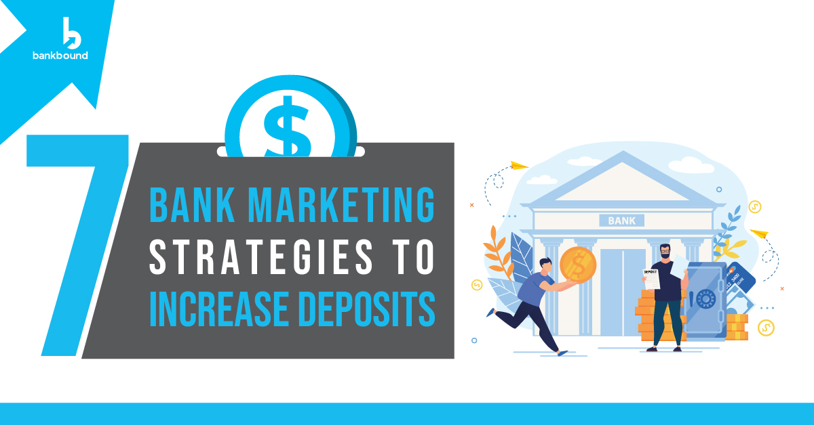
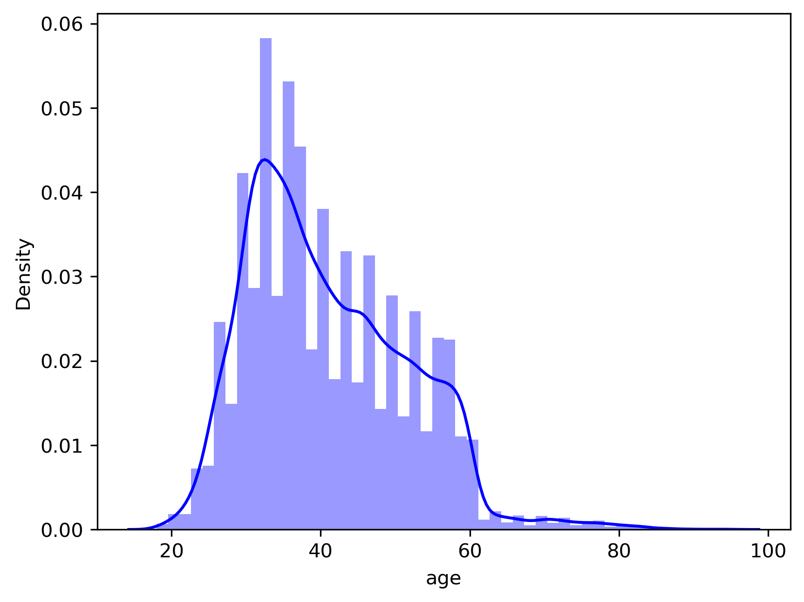
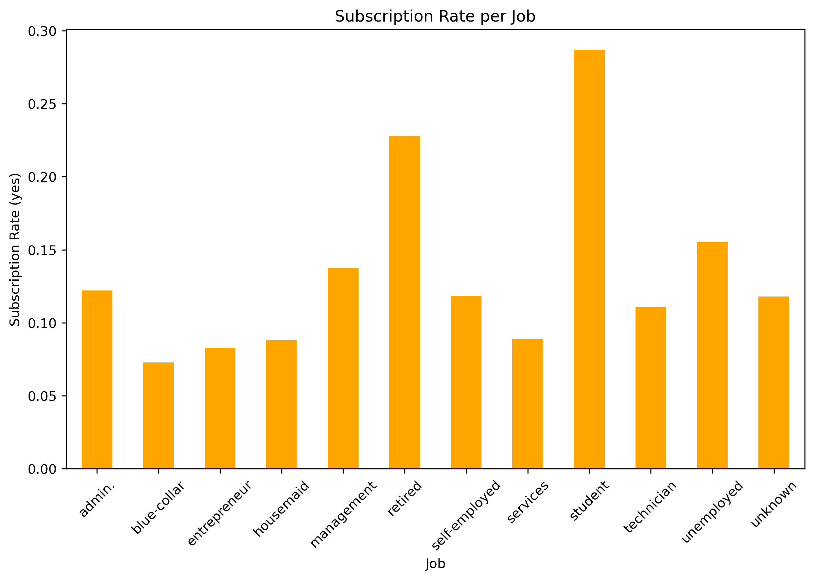
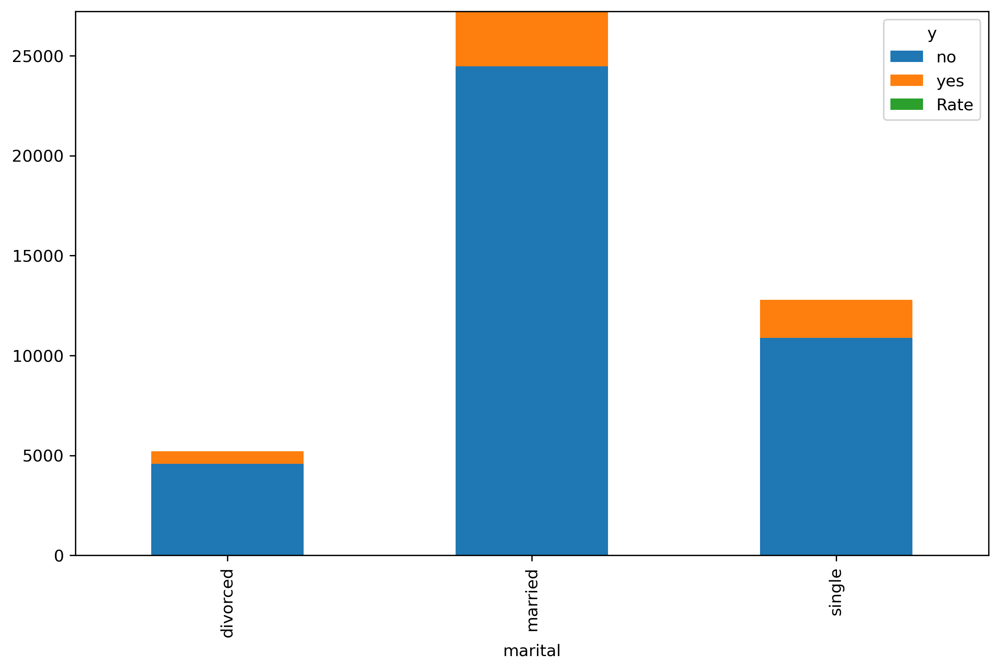
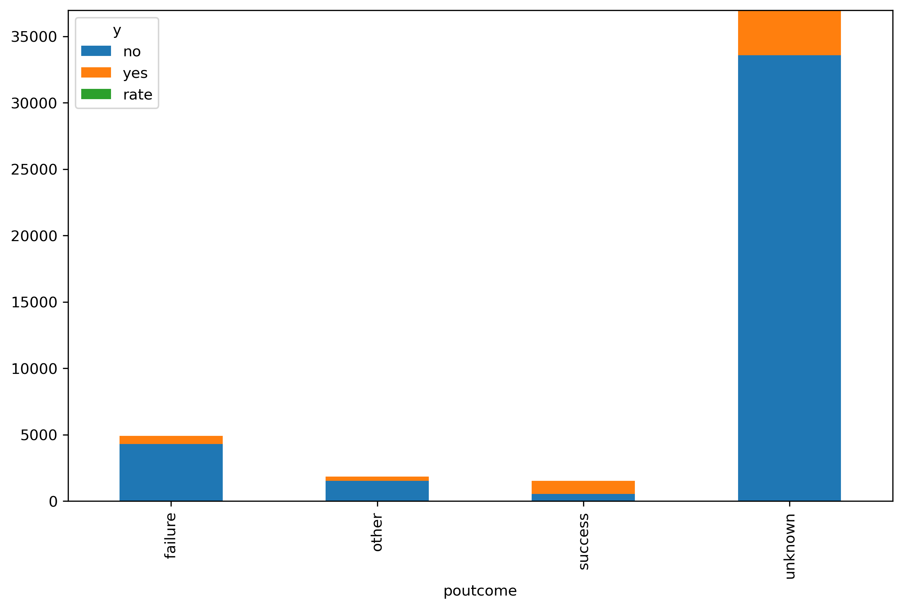
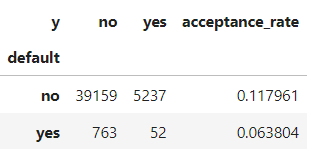
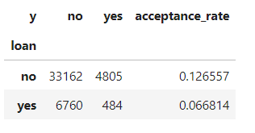
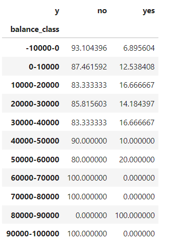

# Customer-Subscription-to-Bank-Term-Deposits
This project aims to predict whether a client will subscribe to a bank term deposit based on historical data from direct marketing campaigns conducted by a Portuguese banking institution. 

# Data Understanding
The dataset used for this project is `bank-full.csv`, sourced from the UCI Machine Learning Repository: [Download](https://archive.ics.uci.edu/dataset/222/bank+marketing), which contains data from direct marketing campaigns. The dataset consists of 17 input variables and one target variable `y`. The target variable `y` indicates whether a client has subscribed to a term deposit `yes` or not `no`.

## The variables/Features used for this project are:

1. `age` which is an integer
2. `job` which explains the type of job (categorical: `admin`,`blue-collar`,`entrepreneur`,`housemaid`,`management`,`retired`,`self-employed`,`services`,`student`,`technician`,`unemployed`,`unknown`)
3. `marital` which is marital status (categorical: `divorced`,`married`,`single`,`unknown`; note: 'divorced' means divorced or widowed)
4. `default` which explains if the customer has credit in default - Binary
5. `balance` which is the average yearly balance - Integer
6. `housing` which is if the customer has housing loan - binary
7. `loan` which is if the client has personal loan - binary
8. `campaign` which is the number of contacts performed during this campaign and for this client (numeric, includes last contact)
9. `poutcome` explains the outcome of the previous marketing campaign (categorical: `failure`,`nonexistent`,`success`)
10. `y` which is the target. has the client subscribed a term deposit?

## Project Workflow:

### Data Preprocessing: 
Cleaning and transforming the data, including encoding categorical variables and normalizing numerical data.

### Exploratory Data Analysis (EDA): 
Analyzing data distribution, relationships, and identifying key patterns.
Analyzed:
1. Age distribution to check for normality. 
2. Job categories and acceptance rate. 
3. Marital status and acceptance rate. 
4. Outcome of previous campaigns and subscription rate 
5. Bank loan effects on acceptance rate, defaulted or servicing 
 

6. Yearly balance relationship to accepting rate. 

### Model Development:
Used:
1. logistic regression - flexible and simple classifier
2. decision treesclassification models - good in non-limiear distributions
and evaluated their performance.

### Model Evaluation: 
Using accuracy, precision, recall, and F1-score to assess model effectiveness.
#### Logistic model has an accuracy of 81% - good in predicting no outcomes
#### Decision Tree has an accuracy of 70% - better predicts the yes outcomes

### Findings: 
Providing strategic insights based on model results to enhance marketing efforts.
1. Individuals who have lower financial responsibilities such as students, retired or divorced not neglecting the others such as admin and management job categories
2. Individuals who have a yearly bank balance of $80,000 - $90,000 and more campaigns on $10,000 - $60,000
3. Those Who do not have an existing bank loan or have not defaulted on the loan not neglecting others as there can be success still
4. Only doing 1-5 campaigns per customer
5. Those who have an existing or previously subscribed to deposit terms
6. A logistic model and Decision tree can be used to model so as to predict the rate of acceptance, Though a more balanced dataset should be used for training the models